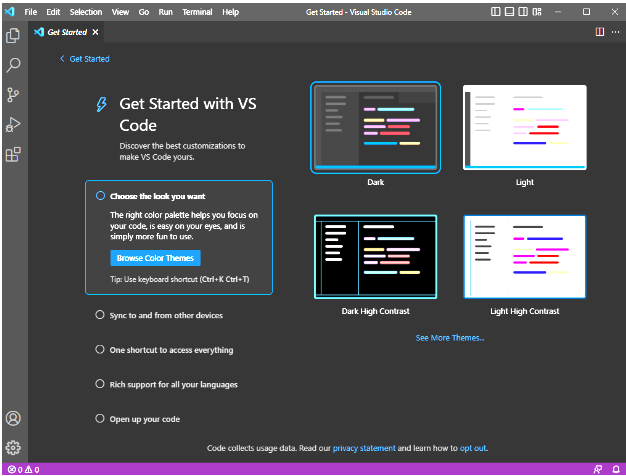
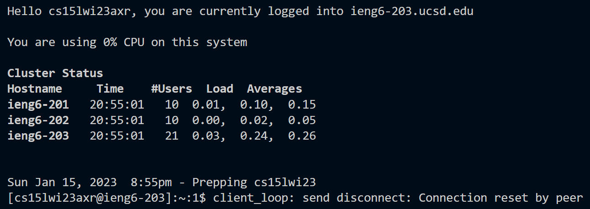
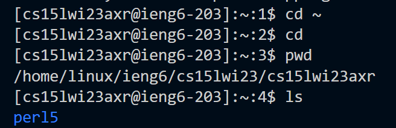

# CSE 15 LAB 1

In order to log into your CSE 15 account, we will need to first download VS CODE. In orde to do that we go to the following link : [VSCode](https://code.visualstudio.com/download)
Once we are there, we need top download the software for the specific operatin system we have, and follow through the installation. If done correctly, we open it up and should see something like this:

Then we need to open a terminal using bash, and type in the following command: `$ ssh cs15lwi23zz@ieng6.ucsd.edu`, but substituting everything before the `@` to your corresponding CSE 15L account. Once that command is in, you will need to type in your password (no indication of typing is showed!). If done correctly, something like this should appear: 

We can now try some commands on the remote computer that we have logged into. Here are a couple of examples:

A couple of interesting things about these commands is in their functionality. As we can see, `pwd` produces an output, as it stands for **"print current directory"** being the current direcotry that we are working in. `cd` stands for **"change direcotry"**, and when putting the `~` in front makes it move backwards in the directory. Using these commands we can effectively navigate through the directories as the need to move arises.
