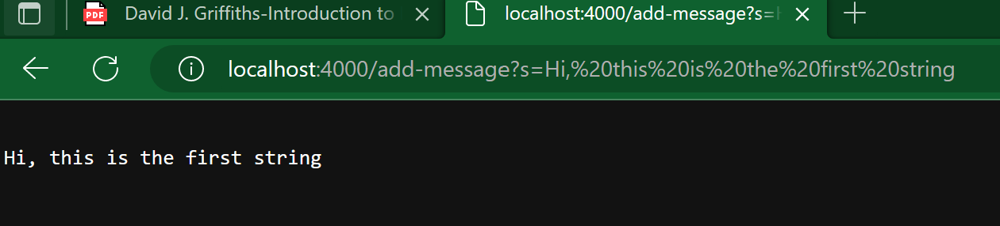

#CSE 15 LAB 2

Here is the code for StringServer

```java

import java.io.IOException;
import java.net.URI;

class Handler implements URLHandler {
    // The one bit of state on the server: a string that will be manipulated by
    // various requests.
    String str = "";

    public String handleRequest(URI url) {
        if (url.getPath().equals("/")) {
            return String.format(str);
        } else {
            System.out.println("Path: " + url.getPath());
            if (url.getPath().contains("/add-message")) {
                String[] parameters = url.getQuery().split("=");
                if (parameters[0].equals("s")) {
                    str = str + "\n" + parameters[1];
                    return String.format(str);
                }
            }
            return "404 Not Found!";
        }
    }
}

class StringServer {
    public static void main(String[] args) throws IOException {
        if(args.length == 0){
            System.out.println("Missing port number! Try any number between 1024 to 49151");
            return;
        }

        int port = Integer.parseInt(args[0]);

        Server.start(port, new Handler());
    }
}

```

By making the first input in the URL we get:



In this image, first the HnadleUrl method is called. Inside this method the value of str is just an empty string `""` at the start of the method. Then, the conditional statements begin to run, the URL is extracted and put into a string by the method getURL and gets inputted into the method. As the first one is false and is not run, the next else statement does become true. Then the nested if loops also run, checking that the URL does have `"/add-message"` in it. Then it splits the query that follows after `?` and splits it at the `=` sign. The values of the split string are stores in `parameters[]`, an array. It reads "s" in `parameters[0]` and the last if loop runs, adding the string after the `=`, which is stored in `parameters[1]`, to the master string `str`. The string is then printed at the webpage as shown in the image.


In this image, the same scenario as in the first picture runs, with the difference that there is already a string stored in the master String, and the new one just gets added, with \n so that it goes in the next line when printed.
