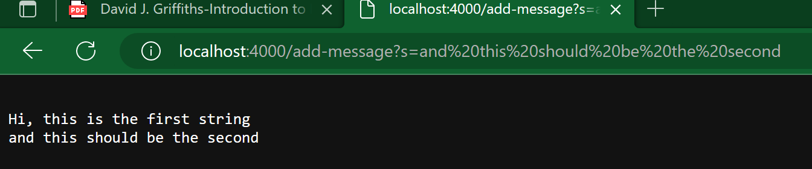

# CSE 15 LAB 2

Here is the code for StringServer

```java

import java.io.IOException;
import java.net.URI;

class Handler implements URLHandler {
    // The one bit of state on the server: a string that will be manipulated by
    // various requests.
    String str = "";

    public String handleRequest(URI url) {
        if (url.getPath().equals("/")) {
            return String.format(str);
        } else {
            System.out.println("Path: " + url.getPath());
            if (url.getPath().contains("/add-message")) {
                String[] parameters = url.getQuery().split("=");
                if (parameters[0].equals("s")) {
                    str = str + "\n" + parameters[1];
                    return String.format(str);
                }
            }
            return "404 Not Found!";
        }
    }
}

class StringServer {
    public static void main(String[] args) throws IOException {
        if(args.length == 0){
            System.out.println("Missing port number! Try any number between 1024 to 49151");
            return;
        }

        int port = Integer.parseInt(args[0]);

        Server.start(port, new Handler());
    }
}

```

By making the first input in the URL we get:


In this image, first the `handleRequests` method is called, which takes the url as argument. Inside this method the value of str is just an empty string `""` at the start of the method. Then, the conditional statements begin to run, the URL is extracted and put into a string by the method `getPath`, which has no arguments and returns the path of the URL, and gets inputted into the method. As the first one is false and is not run, the next else statement does become true. Then the nested if loops also run, checking that the URL does have `"/add-message"` in it. Then it splits the query that follows after `?` and splits it at the `=` sign. The values of the split string are stores in `parameters[]`, an array. It reads "s" in `parameters[0]` and the last if loop runs, adding the string after the `=`, which is stored in `parameters[1]`, to the master string `str`. The string is then printed at the webpage as shown in the image. At the end of this process, the only variable that is changed is the string `str`, which is the global viarble that the subsequent strings get added to.



In this image, the same scenario as in the first picture runs, with the difference that there is already a string stored in the master String, and the new one just gets added, with `\n` so that it goes in the next line when printed. `str` gets updated to contain both strings and is the only variable that has been changed.

## Part 2

Failiure inducing test 

```java

  @Test
  public void testReversedFail() {
    int[] input1 = {1, 2, 3};
    assertArrayEquals(new int[] {3, 2, 1}, ArrayExamples.reversed(input1));
  }
  
```

Input that doesnt induce failiure

```java

	@Test 
	public void testReverseInPlace() {
    int[] input1 = { 3 };
    ArrayExamples.reverseInPlace(input1);
    assertArrayEquals(new int[]{ 3 }, input1);
	}


  @Test
  public void testReversed() {
    int[] input1 = { };
    assertArrayEquals(new int[]{ }, ArrayExamples.reversed(input1));
  }
```
Tests being run 


Code before:

```java

public class ArrayExamples {

  // Changes the input array to be in reversed order
  static void reverseInPlace(int[] arr) {
    for(int i = 0; i < arr.length; i += 1) {
      arr[i] = arr[arr.length - i - 1];
    }
  }

  // Returns a *new* array with all the elements of the input array in reversed
  // order
  static int[] reversed(int[] arr) {
    int[] newArray = new int[arr.length];
    for(int i = 0; i < arr.length; i += 1) {
      arr[i] = newArray[arr.length - i - 1];
    }
    return arr;
  }
```

Code after the fix:

```java
public class ArrayExamples {

  // Changes the input array to be in reversed order
  static void reverseInPlace(int[] arr) {

    int[] placeholder = new int[arr.length];
    for(int i = arr.length - 1; i > -1; i -= 1) {
      placeholder[arr.length - 1 - i] = arr[i];
    }
    for(int i = 0; i < arr.length; i += 1) {
      arr[i] = placeholder[i];
    }
  }

  // Returns a new array with all the elements of the input array in reversed
  // order
  static int[] reversed(int[] arr) {
    int[] newArray = new int[arr.length];
    for(int i = 0; i < arr.length; i += 1) {
      newArray[arr.length - i - 1] = arr[i];
    }
    return newArray;
  }
```

## Part 3

Soomething that I learned that is definitely interesting is everything about URLs, web servers, and everything from week 2's lab. I feel like even thouhg it is intro information into these topics, it really demonstrates the capabilities that we have with java for group projects and collaboration. I definitely dont know most of the content we learn in this class, but this one is for sure the most interesting by far.
