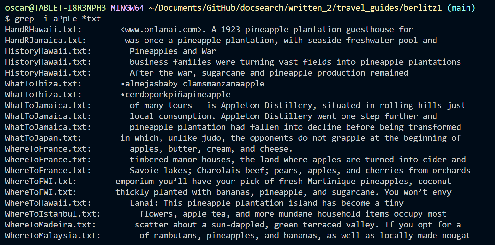

# Lab 3 Report

In this lab I will be exploring different uses for the `grep` command on bash. For this we will use the written_2 directory on docsearch.
For these examples, I will be using the `berlitz1` directory that contains multiple `.txt` files.

First, I will show how we can use grep to find a specific word in a directory. The word of shoice is "apple":
The input command is `grep apple *txt` which allows us to find the word apple in all of the `.txt` files contained in the directory

```
$ grep apple *txt
HandRHawaii.txt:        <www.onlanai.com>. A 1923 pineapple plantation guesthouse for
HandRJamaica.txt:        was once a pineapple plantation, with seaside freshwater pool and
HistoryHawaii.txt:        Pineapples and War
HistoryHawaii.txt:        business families were turning vast fields into pineapple plantations
HistoryHawaii.txt:        After the war, sugarcane and pineapple production remained
WhatToIbiza.txt:        •almejasbaby clamsmanzanaapple
WhatToIbiza.txt:        •cerdoporkpiñapineapple
WhatToJamaica.txt:        pineapple plantation had fallen into decline before being transformed
WhatToJapan.txt:        in which, unlike judo, the opponents do not grapple at the beginning of
WhereToFrance.txt:        apples, butter, cream, and cheese.
WhereToFrance.txt:        timbered manor houses, the land where apples are turned into cider and
WhereToFrance.txt:        Savoie lakes; Charolais beef; pears, apples, and cherries from orchards
WhereToFWI.txt:        emporium you’ll have your pick of fresh Martinique pineapples, coconut
WhereToFWI.txt:        thickly planted with bananas, pineapple, and sugarcane. You won’t envy
WhereToHawaii.txt:        Lanai: This pineapple plantation island has become a tiny
WhereToIstanbul.txt:        flowers, apple tea, and more mundane household items occupy most
WhereToMadeira.txt:        scatter about a sun-dappled, green terraced valley. If you opt for a
WhereToMalaysia.txt:        of rambutans, pineapples, and bananas, as well as locally made nougat
```

Now lets try it with the word "cigar"

```
$ grep cigar *.txt
IntroFrance.txt:        mustachioed fellow with a beret on his head, a crumpled cigarette
IntroJapan.txt:        cigarettes from a machine located inches from a sacred Shinto shrine.
WhatToIbiza.txt:        the airport duty-free shop are lower still. Imported Cuban cigars,
WhatToJamaica.txt:        Thousands of makeshift shacks sell beer or cigarettes, and hundreds of
WhatToJamaica.txt:        veritable treasure-trove of quality gems, gold, and cigars. Take a look
WhatToMallorca.txt:        brands made under license in Spain. Cuban cigars are significantly less
WhereToFWI.txt:        despite such hold-outs as thin cigars, gin, and Indonesian rijstafel,
WhereToMalaysia.txt:        sure that you have gifts — cigarettes, sweets, and little toys for the
```


Looking at the lines where these words show up might leave us with a bit of confusion, since some of them show in some "interesting" lines. 
For that case, we have a special addition to the grep command, by adding `-C` to the commad, we are able to see the words context!
The number after `-C` determines the amount of lines we want to see before and after the line the word appears in.

Lets try an example on one apple instance:

```
$ grep -C 2 apple WhereToFrance.txt
        green farmland, timber-framed houses, ruined abbeys, Romanesque
        churches, and busy cities, all with a distinctive cuisine featuring
        apples, butter, cream, and cheese.
        Brittany’s countryside is wilder and less civilized, with
        a jagged coastline to match. But the rugged coast shelters many sandy
--
        Inland from the Côte Fleurie the countryside reflects the
        popular image of Normandy: orchards, rolling valleys, and massive
        timbered manor houses, the land where apples are turned into cider and
        Calvados, and dairies churn out pungent, creamy Camem­bert, Livarot,
        and Pont-l’Evêque.
--
        Medi­ter­ra­ne­an warmth and light. Some of the best food in the
        country is produced here: poultry from Bresse; freshwater fish from the
        Savoie lakes; Charolais beef; pears, apples, and cherries from orchards
        to the north of town, and peaches and apricots from the ones to the
        south.
 ```

And for the cigar:

```
$ grep -C 2 cigar IntroFrance.txt
        The people are as varied as their landscape, but don’t let
        anyone tell you the French national cliché is a myth. The red-nosed,
        mustachioed fellow with a beret on his head, a crumpled cigarette
        drooping from his lip, and a long baguette or two under his arm
        certainly does exist and can be seen in all regions of the country. But
 ```

These are for sure more understandable and interesting reads! We can now get a better idea of how these words came about.


We can also look for words in a case-insensitive manner. Meaning, it will ignore the restrictions on uppercase and lower case.
Lets demonstrate with the apple example.

First, we make a search, with alternating upper-case and lower-case letters:


As we can see, nothing is output, that is because grep is case sensitive, and there is no instance of the word that is written exactly like that.
Now making use of `-i` to make it case insensitive:



And now the output is as expected!


Finally, we will talk about a more practical than interesting use of grep. So far, we have looked at `.txt` files in a single directory. But the grep command can do more than that. By adding `-r` to the command, it will look for the given pattern in the directory and all of its subdirectories!

We will repeat the process with both apple and cigar, but now on the entire travel_guides direcotry (both berlitz 1 and 2):

```
$ grep -r apple travel_guides
travel_guides/berlitz1/HandRHawaii.txt:        <www.onlanai.com>. A 1923 pineapple plantation guesthouse for
travel_guides/berlitz1/HandRJamaica.txt:        was once a pineapple plantation, with seaside freshwater pool and
travel_guides/berlitz1/HistoryHawaii.txt:        Pineapples and War
travel_guides/berlitz1/HistoryHawaii.txt:        business families were turning vast fields into pineapple plantations
travel_guides/berlitz1/HistoryHawaii.txt:        After the war, sugarcane and pineapple production remained
travel_guides/berlitz1/WhatToIbiza.txt:        •almejasbaby clamsmanzanaapple
travel_guides/berlitz1/WhatToIbiza.txt:        •cerdoporkpiñapineapple
travel_guides/berlitz1/WhatToJamaica.txt:        pineapple plantation had fallen into decline before being transformed
travel_guides/berlitz1/WhatToJapan.txt:        in which, unlike judo, the opponents do not grapple at the beginning of
travel_guides/berlitz1/WhereToFrance.txt:        apples, butter, cream, and cheese.
travel_guides/berlitz1/WhereToFrance.txt:        timbered manor houses, the land where apples are turned into cider and
travel_guides/berlitz1/WhereToFrance.txt:        Savoie lakes; Charolais beef; pears, apples, and cherries from orchards
```
The output is way longer, but shortened it for your sake. (Berlitz 2 contains VERY LARGE 1 line sentences, so the output is very long.

We can do the same for cigar:

```
$ grep -r cigar travel_guides
travel_guides/berlitz1/IntroFrance.txt:        mustachioed fellow with a beret on his head, a crumpled cigarette
travel_guides/berlitz1/IntroJapan.txt:        cigarettes from a machine located inches from a sacred Shinto shrine.
travel_guides/berlitz1/WhatToIbiza.txt:        the airport duty-free shop are lower still. Imported Cuban cigars,
travel_guides/berlitz1/WhatToJamaica.txt:        Thousands of makeshift shacks sell beer or cigarettes, and hundreds of
travel_guides/berlitz1/WhatToJamaica.txt:        veritable treasure-trove of quality gems, gold, and cigars. Take a look        
travel_guides/berlitz1/WhatToMallorca.txt:        brands made under license in Spain. Cuban cigars are significantly less
travel_guides/berlitz1/WhereToFWI.txt:        despite such hold-outs as thin cigars, gin, and Indonesian rijstafel,
travel_guides/berlitz1/WhereToMalaysia.txt:        sure that you have gifts — cigarettes, sweets, and little toys for the
travel_guides/berlitz2/Algarve-WhatToDo.txt:Cigars. There is a small but high-quality cigar industry in Holland with a wide choice in terms of size and price. P.G.C. Hajenius on Rokin has been producing their own brand of cigars and importing the best in the world for 170 years. They also have a smoking café if you want to sit and enjoy your cigar on the premises. Their shop, specially built for the company in 1915, has a beautiful Art-Deco interior.
```
Again output is very long, but shortened.

ALL OF THE COMMAND IDEAS AND SOURCES COME FROM CHATGPT


