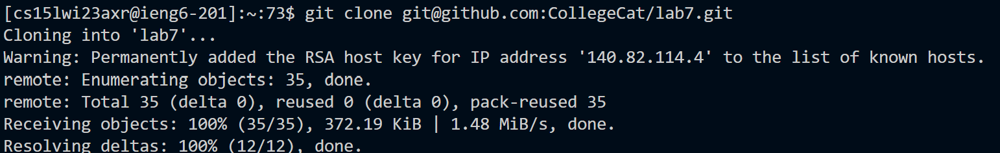
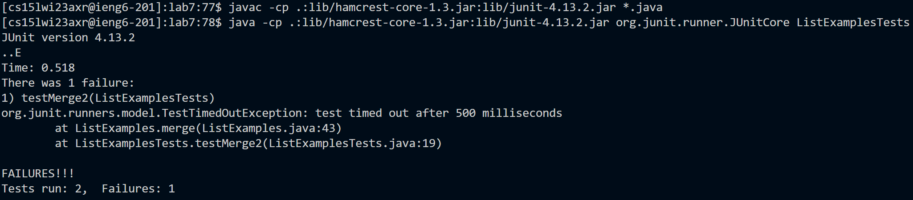
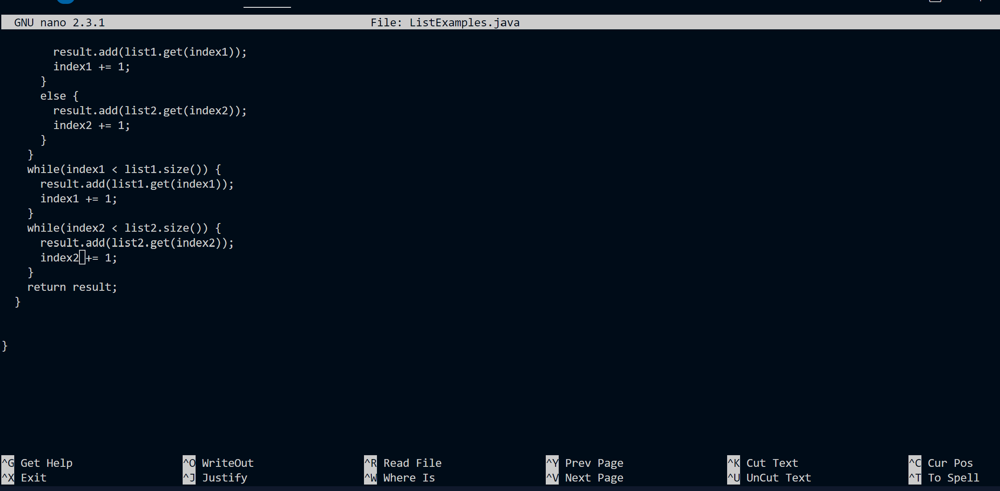
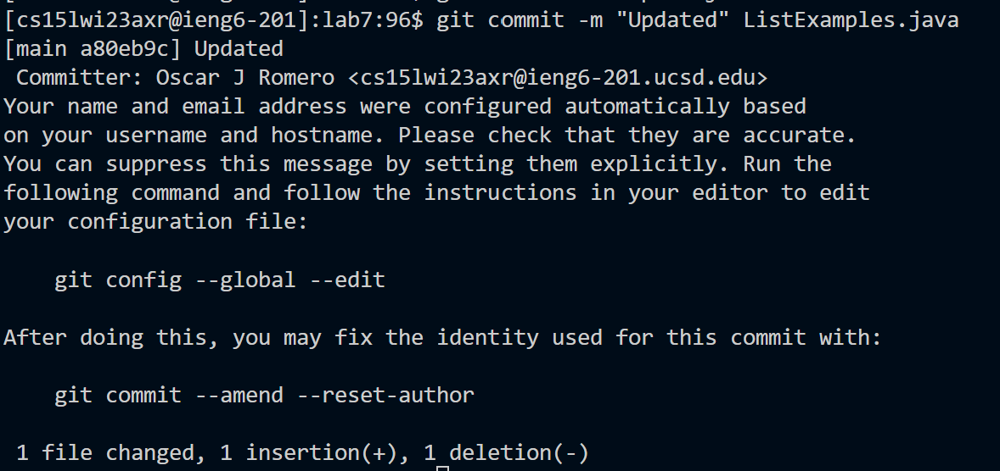

# Lab 4 Report

First we log in with the command `ssh <Ctrl> V @ieng6.ucsd.edu <enter>` where we pasted the login information.

Then we clone the repository using `git clone <Ctrl> V` where the SSH was copid to clone the repo.



Then we run the tests using 

```
cd la<tab> <enter>
<up> <up> <up> <up> <up> <up> <up> <up> <up> <up> <up> <up> <up> <up> <up> <enter>
<up> <up> <up> <up> <up> <up> <up> <up> <up> <up> <up> <up> <up> <up> <up> <enter>
```

In the first line, we autocomplete with tab to get into the lab7 directory.
Then I move up until I get both the compiler and the tester commands (which were saved in the command line history).



As we see the tests failed. So in order to fix we use nano to edit the file ListExamples.java, with the commands

```
nano ListExamples.java

<down> (hold until bottom) <up> <up> <up> <up> <backspace> 2 <Ctrl> X <enter>
```

Frist we initialize nano, then we scroll down to the line that needs to be fixed, and replace the right value.



Then we run the tests to verify that they passed.

```
<up> <up> <up> <up> <up> <up> <up> <Enter>

<up> <up> <up> <up> <up> <up> <up> <Enter>
```

Same as above, the commands were saved in the history.

Finally we push and commit with 
```
git commit -m "Updated" ListExamples.java
git push
```
And the output is the desired.


